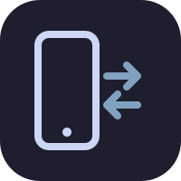
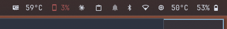
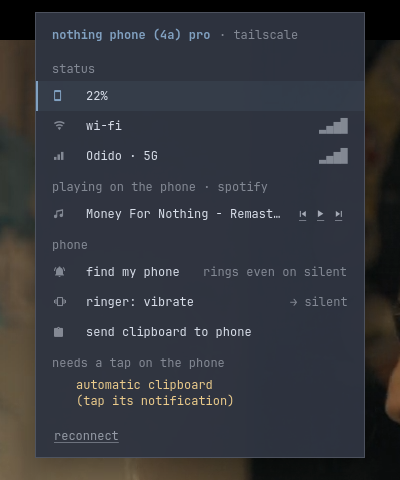

<a id="readme-top"></a>


<!-- PROJECT SHIELDS -->
[![Contributors][contributors-shield]][contributors-url]
[![Forks][forks-shield]][forks-url]
[![Stargazers][stars-shield]][stars-url]
[![Issues][issues-shield]][issues-url]
[![MIT License][license-shield]][license-url]


<!-- PROJECT LOGO -->
<br />
<div align="center">
  <a href="https://github.com/DaanHessen/phonectl">
    
  </a>

  <h3 align="center">phonectl</h3>

  <p align="center">
    Your Android phone, wired into your Linux desktop, on any network.
    <br />
    <a href="docs/"><strong>Explore the docs »</strong></a>
    <br />
    <br />
    <a href="https://github.com/DaanHessen/phonectl/issues/new?labels=bug">Report Bug</a>
    &middot;
    <a href="https://github.com/DaanHessen/phonectl/issues/new?labels=enhancement">Request Feature</a>
  </p>
</div>


<!-- TABLE OF CONTENTS -->
<details>
  <summary>Table of Contents</summary>
  <ol>
    <li>
      <a href="#about-the-project">About The Project</a>
      <ul>
        <li><a href="#built-with">Built With</a></li>
      </ul>
    </li>
    <li>
      <a href="#getting-started">Getting Started</a>
      <ul>
        <li><a href="#prerequisites">Prerequisites</a></li>
        <li><a href="#installation">Installation</a></li>
      </ul>
    </li>
    <li><a href="#usage">Usage</a></li>
    <li><a href="#roadmap">Roadmap</a></li>
    <li><a href="#contributing">Contributing</a></li>
    <li><a href="#license">License</a></li>
    <li><a href="#contact">Contact</a></li>
    <li><a href="#acknowledgments">Acknowledgments</a></li>
  </ol>
</details>


<!-- ABOUT THE PROJECT -->
## About The Project

<div align="center">
  
  <br /><br />
  
</div>

phonectl is a personal, much leaner take on KDE Connect, built for one phone
(a Nothing Phone (4a) Pro on Android 16) and one desktop (Omarchy: Hyprland,
Waybar, mako). It is a small Android app plus a Rust daemon on the laptop that
talk over the [Tailscale](https://tailscale.com/) network both devices are
already on. Phone on 5G and laptop on school Wi-Fi? Still connected. No network
at all? It falls back to Bluetooth.

What it does:
* **Clipboard sync, both ways**, with loop prevention and "newest wins" after a reconnect. Password-manager clips are never sent
* **Phone notifications on the desktop** (mako or any freedesktop daemon): app name and icon, updates in place, removal and dismissal in both directions, actions and "open on phone"
* **Calls pause laptop media** (any MPRIS player) and resume exactly what was paused once the call ends
* **Waybar module and drop-down panel**: battery, charging, Wi-Fi/mobile signal, 5G/LTE, carrier, call state, now playing on the phone, find my phone, ringer mode
* **Made to be left running**: no polling, no foreground service or permanent notification on the phone, event-driven reconnects, and no ADB once set up (some payment apps refuse to run while debugging is on)


### Built With

* [![Rust][Rust-badge]][Rust-url]
* [![Kotlin][Kotlin-badge]][Kotlin-url]
* [![Android][Android-badge]][Android-url]
* [![Tailscale][Tailscale-badge]][Tailscale-url]
* [![Waybar][Waybar-badge]][Waybar-url]


<!-- GETTING STARTED -->
## Getting Started

phonectl is tuned for one setup, but nothing in it is specific to Nothing
phones: any Android 13+ phone and any Wayland desktop with systemd should work.

### Prerequisites

* Tailscale on both the laptop and the phone, in the same tailnet
* `wl-clipboard`, BlueZ and a systemd user session on the laptop
* Rust 1.90+, JDK 17 and the Android SDK (platform 36) to build
* `adb` with Wireless debugging paired, for the one-time setup only

### Installation

1. Clone the repo
   ```sh
   git clone https://github.com/DaanHessen/phonectl.git
   cd phonectl
   ```
2. Build the phone app and the laptop binary
   ```sh
   (cd android && ./gradlew assembleRelease)
   cargo build --release
   ln -sf "$PWD/target/release/phonectl" ~/.local/bin/phonectl
   ```
3. Start the daemon
   ```sh
   cp contrib/phonectl.service ~/.config/systemd/user/
   systemctl --user enable --now phonectl
   ```
4. Install, grant and pair the phone app, then turn Wireless debugging off again
   ```sh
   phonectl setup
   ```
5. Add the Waybar module
   ```jsonc
   "custom/phonectl": {
     "exec": "phonectl waybar",
     "return-type": "json",
     "restart-interval": 10,
     "on-click-right": "phonectl clip",
     "on-click-middle": "phonectl connect"
   }
   ```

Optional settings go in `~/.config/phonectl/config.toml` (`name`, `port`,
`dismiss_on_phone`); `PHONECTL_LOG` sets the daemon's log level.


<!-- USAGE EXAMPLES -->
## Usage

Once running there is nothing to do: copy on one device, paste on the other;
notifications and calls just show up. The CLI covers the rest:

```
phonectl status [--json]      phone and link status
phonectl clip                 send the laptop clipboard to the phone now
phonectl connect              ask the phone to connect now
phonectl ring [--stop]        find my phone (rings even on silent)
phonectl ringer MODE          normal | vibrate | silent
phonectl media ACTION         toggle | play | pause | next | previous
phonectl test-notification    post a test notification on the phone
phonectl events               live link events
phonectl diag                 the phone app's own log, no ADB needed
phonectl update               install a new app build over the link
```

**How it connects.** The laptop listens only on its Tailscale address and the
phone always dials, so Tailscale handles NAT and network changes; a session
usually survives a Wi-Fi ↔ 5G switch untouched. Without a network the phone
uses Bluetooth RFCOMM and moves back to Tailscale as soon as it can. The laptop
sends a small authenticated UDP "poke" on startup, resume and network change,
so the phone reconnects at once instead of waiting for its backoff, and tells
the phone before it suspends so the phone stays quiet meanwhile.

**Known limits (Android, not bugs).**
* Automatic phone → laptop clipboard needs one tap after every phone reboot or app update. Android only lets the focused app read the clipboard, so phonectl spots changes in the system log and briefly focuses an invisible activity to read them (like KDE Connect). Android 13+ asks for log-access consent, but only shows that prompt to an app on screen, so after a restart a quiet notification asks for a tap. Until then, share text to "Send to laptop" or use the Quick Settings tile.
* Replies to messages are not possible from the laptop yet (mako has no text input); other notification actions work.
* Wi-Fi Direct is not used: Android asks the user to accept every connection, and Bluetooth is enough for this little data.

_Design notes and research are in [docs](docs/)._


<!-- ROADMAP -->
## Roadmap

- [x] Tailscale link with event-driven reconnect
- [x] Clipboard sync both ways
- [x] Notification mirroring with actions and removal
- [x] Pause/resume media for calls
- [x] Waybar module and phone panel
- [x] Updates over the link
- [ ] Bluetooth fallback tested end to end
- [ ] Reply to messages from the laptop
- [ ] Re-check everything on Android 17

See the [open issues](https://github.com/DaanHessen/phonectl/issues) for a full list of proposed features (and known issues).


<!-- CONTRIBUTING -->
## Contributing

This is a personal project, tuned for one phone and one desktop. Issues, ideas
and pull requests are still welcome.

1. Fork the Project
2. Create your Feature Branch (`git checkout -b feature/AmazingFeature`)
3. Commit your Changes (`git commit -m 'Add some AmazingFeature'`)
4. Push to the Branch (`git push origin feature/AmazingFeature`)
5. Open a Pull Request

Run `cargo test` and `(cd android && ./gradlew testDebugUnitTest)` before
opening one; both sides pin the same protocol test vectors.

### Top contributors:

<a href="https://github.com/DaanHessen/phonectl/graphs/contributors">
  
</a>


<!-- LICENSE -->
## License

Distributed under the MIT License. See `LICENSE` for more information.


<!-- CONTACT -->
## Contact

Daan Hessen - [@DaanHessen](https://github.com/DaanHessen)

Project Link: [https://github.com/DaanHessen/phonectl](https://github.com/DaanHessen/phonectl)


<!-- ACKNOWLEDGMENTS -->
## Acknowledgments

* [KDE Connect](https://kdeconnect.kde.org/), for showing what a phone-desktop bridge can be
* [scrcpy](https://github.com/Genymobile/scrcpy), whose research shaped the early ADB experiments
* [zbus](https://github.com/dbus2/zbus) and [bluer](https://github.com/bluez/bluer)
* [Img Shields](https://shields.io)
* [Best-README-Template](https://github.com/othneildrew/Best-README-Template)

<p align="right">(<a href="#readme-top">back to top</a>)</p>


<!-- MARKDOWN LINKS & IMAGES -->
[contributors-shield]: https://img.shields.io/github/contributors/DaanHessen/phonectl.svg?style=for-the-badge
[contributors-url]: https://github.com/DaanHessen/phonectl/graphs/contributors
[forks-shield]: https://img.shields.io/github/forks/DaanHessen/phonectl.svg?style=for-the-badge
[forks-url]: https://github.com/DaanHessen/phonectl/network/members
[stars-shield]: https://img.shields.io/github/stars/DaanHessen/phonectl.svg?style=for-the-badge
[stars-url]: https://github.com/DaanHessen/phonectl/stargazers
[issues-shield]: https://img.shields.io/github/issues/DaanHessen/phonectl.svg?style=for-the-badge
[issues-url]: https://github.com/DaanHessen/phonectl/issues
[license-shield]: https://img.shields.io/github/license/DaanHessen/phonectl.svg?style=for-the-badge
[license-url]: https://github.com/DaanHessen/phonectl/blob/master/LICENSE
[Rust-badge]: https://img.shields.io/badge/Rust-000000?style=for-the-badge&logo=rust&logoColor=white
[Rust-url]: https://www.rust-lang.org/
[Kotlin-badge]: https://img.shields.io/badge/Kotlin-7F52FF?style=for-the-badge&logo=kotlin&logoColor=white
[Kotlin-url]: https://kotlinlang.org/
[Android-badge]: https://img.shields.io/badge/Android-34A853?style=for-the-badge&logo=android&logoColor=white
[Android-url]: https://developer.android.com/
[Tailscale-badge]: https://img.shields.io/badge/Tailscale-242424?style=for-the-badge&logo=tailscale&logoColor=white
[Tailscale-url]: https://tailscale.com/
[Waybar-badge]: https://img.shields.io/badge/Waybar-1E1E2E?style=for-the-badge&logo=wayland&logoColor=FFBC00
[Waybar-url]: https://github.com/Alexays/Waybar
